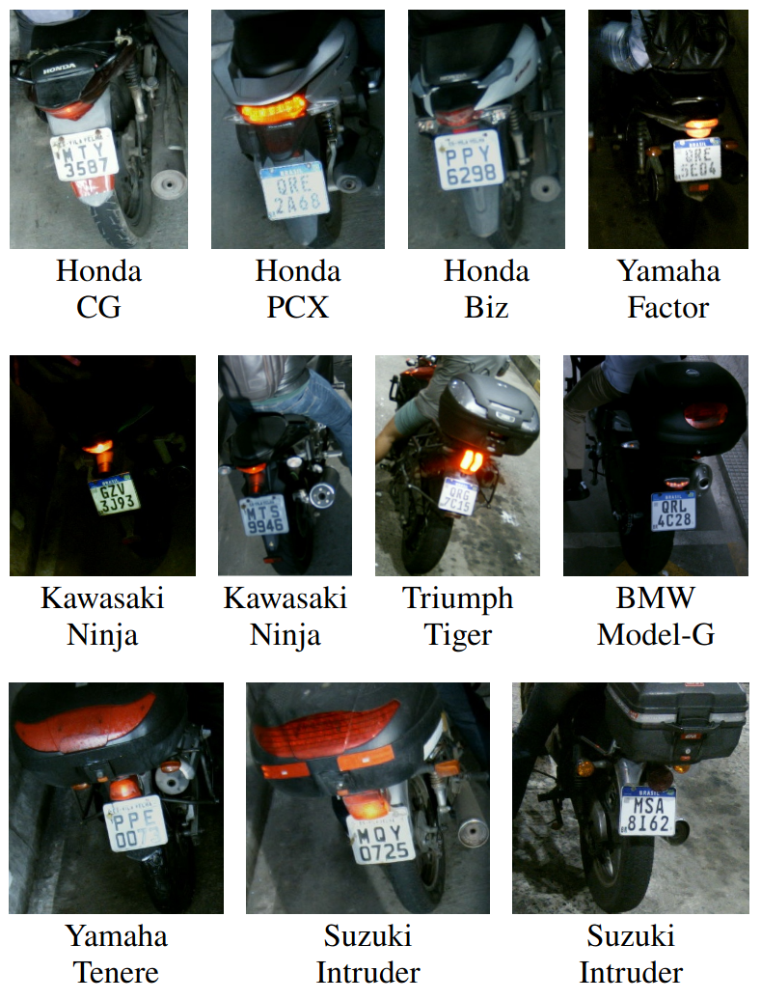
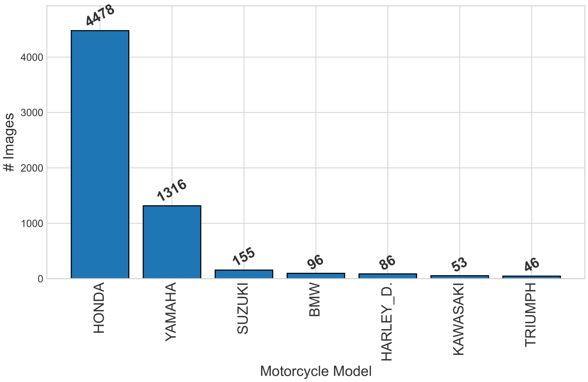
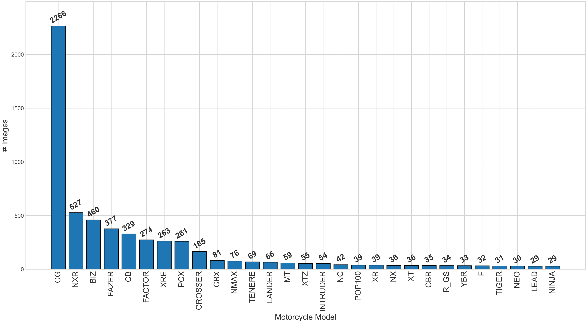

# UFPR-FGMC Dataset

Vehicle recognition from images is a crucial component of Intelligent Transportation Systems (ITS), supporting applications such as automated tolling, access control, and forensics. Fine-Grained Vehicle Classification (FGVC) extends this capability by identifying vehicles by their specific make, model, and type. However, existing research has largely centered on four-wheeled vehicles, with motorcycles receiving limited attention despite representing a substantial share of traffic in many countries, including Brazil. This underrepresentation can reduce the effectiveness and fairness of ITS solutions.

To address this gap, our work, entitled **"A Study on Fine-Grained Motorcycle Classification for Intelligent Transportation Systems"** [[PDF]](./pdfs/lima2025fgmc.pdf), investigates Fine-Grained Motorcycle Classification (FGMC) in real-world ITS scenarios. We evaluated seven deep learning architectures under two training protocols for independent make and model classification. To enable this study, we augmented the [RodoSol-ALPR](https://github.com/raysonlaroca/rodosol-alpr-dataset) dataset — a widely adopted source for Automatic License Plate Recognition (ALPR) — with motorcycle make and model annotations. This effort resulted in two new datasets: *MotorcycleMake* and *MotorcycleModel*.

## About MotorcycleMake and MotorcycleModel

The two datasets are:
* **MotorcycleMake**: Contains 6,230 images across 7 make classes.
* **MotorcycleModel**: Contains 5,827 images across 29 model classes.
  
All images are sourced from the RodoSol-ALPR, a dataset reflecting a real-world Intelligent Transportation System (ITS) scenario at toll booths on a Brazilian highway. Our work utilizes the subset of images that depict motorcycles. As showcased in Fig. 1, these images pose a significant classification challenge, stemming from both the wide range of environmental conditions captured (such as varied lighting and weather) and the restrictive rear-view perspective, which makes it inherently difficult to distinguish between visually similar motorcycles models.

<figure>
    <figcaption>
        <b>Fig. 1.</b> Samples appearing in both the MotorcycleMake and MotorcycleModel datasets. The first and second text rows below each image show the motorcycle make and model, respectively. These examples illustrate variations in lighting conditions and capture angles.
    </figcaption>
  
</figure>

<br>

Fig. 2 presents the class distribution for each subset, revealing a long-tailed pattern typical of Brazilian traffic, where a few makes and models dominate.

<figure>
  <p>
    
    <br>
    (a) MotorcycleMake
  </p>
  <p>
    
    <br>
    (b) MotorcycleModel
  </p>
  <figcaption>
    <b>Fig. 2.</b> Class distribution in the (a) MotorcycleMake and (b) MotorcycleModel datasets.
  </figcaption>
</figure>

<br>

Regarding privacy, the data originates from public roads in Brazil, where license plates are associated with vehicles only, and no public information about vehicle drivers or owners is available. Furthermore, the original RodoSol-ALPR dataset already anonymizes any human faces that may appear in the images.

## How to Obtain the Dataset

As our dataset is derived from RodoSol-ALPR, we grant access to the images, annotations, and data splits upon request, subject to the signing of a licensing agreement. The data is released strictly for academic research and is free to researchers from educational or research institutes for **non-commercial purposes only**.

To request access, please follow these steps:
1.  Review the [**license agreement**](./pdfs/license_agreement.pdf).
2.  Sign the agreement and email the completed document to Rayson Laroca at **rayson@ppgia.pucpr.br**.
3.  Ensure your request is sent from a valid university email account (e.g., .edu, .ac, or similar).

You can expect to receive a download link within 1-5 business days. Please note that failure to follow these instructions may result in your request not being processed.

## Citation

If you use the MotorcycleMake or MotorcycleModel datasets in your research, please cite our paper:

* G. E. Lima, E. Santos, E. Nascimento Jr., R. Laroca, and D. Menotti, "A Study on Fine-Grained Motorcycle Classification for Intelligent Transportation Systems," in *Anais Estendidos da XXXVII Conference on Graphics, Patterns and Images (SIBGRAPI)*, pp. 1-6, Oct. 2025. [SBC-OpenLib] [[ResearchGate]]()

```
@inproceedings{lima2025fgmc,
title     = {A Study on Fine-Grained Motorcycle Classification for Intelligent Transportation Systems},
  author    = {G. E. {Lima} and E. {Santos} and E. {Nascimento Jr.} and R. {Laroca} and D. {Menotti}},
  year      = {2025},
  month     = {Oct},
  booktitle = {Anais Estendidos da XXXVII Conference on Graphics, Patterns and Images (SIBGRAPI)},
  pages     = {1-6},
  doi       = {}
}
```

Note: The work will be presented at the conference in October. After presentation and publication, the citation information will be updated with the final DOI and official publication links.

## Related publications

A list of all our papers on vehicle identification can be seen [here](https://scholar.google.com/scholar?hl=pt-BR&as_sdt=0%2C5&as_ylo=2018&q=allintitle%3A+plate+OR+license+OR+vehicle+author%3A%22David+Menotti%22&btnG=).

## Contact

For any questions or comments, please contact Gabriel E. Lima ([gelima@inf.ufpr.br](mailto:gelima@inf.ufpr.br)).
